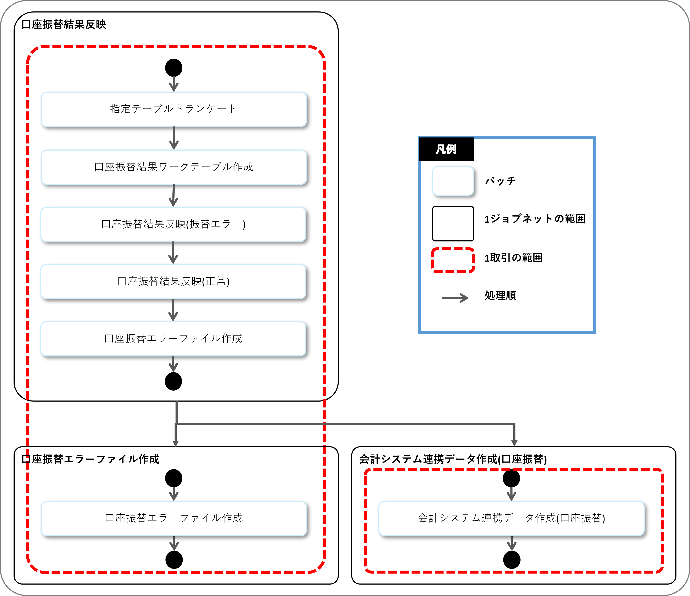

# Nablarch開発標準

## 基本方針
**開発成果物の品質向上・均一化を実現するNablarch開発標準を提供します。**  
Nablarch開発標準とは、開発者が設計書やプログラムコードを作成する際に従うべきガイドラインです。一部、アーキテクト向けの開発標準ドキュメントも用意されています。
Nablarch開発標準には、各種設計書のフォーマットも含まれます。
Nablarch開発標準を遵守することで、開発者がNablarchに最適化された設計書・プログラムを効率的に作成できるようになります。また、大規模基幹システムで問題になることの多い、開発者ごとの成果物品質のばらつきを抑制できます。  


※参考：[Nablarch | サービス／ソリューション | ITソリューションのTIS株式会社](https://www.tis.jp/service_solution/nablarch/)


## 全体構成
Nablarch開発標準は下記４つのコンテンツから構成されます。

|コンテンツ名|概要|
|--|--|
|[開発プロセス標準](./010_開発プロセス標準/)|Nablarchを使用したシステム開発における作業プロセス|
|[アプリケーション開発標準](./020_アプリケーション開発標準/)|UI標準、コーディング規約、単体テスト標準等のアプリケーション開発に必要な標準文書|
|[設計書フォーマット＆サンプル](./030_設計ドキュメント/)|アプリケーション開発時に使用する設計書フォーマットとサンプル|
|[開発プロセス支援ツール](https://github.com/nablarch-development-standards/nablarch-development-standards-tools)|ソースコード自動生成や設計書の自動生成など、開発プロセスを効率化するための支援ツール群|


## コンテンツの特徴
### 設計書に記載すべき情報を極力少なくし、開発生産性を向上させます。
業務アプリケーションを実装するために設計者が決めなければならない仕様のみ設計書に記載します。  
設計書とソースコードの対応関係についてはNablarch開発標準でルールを決めるため、細かい実装に関する情報は設計書に記載しません。  

#### 利点	
* プログラムを作成するために必要な仕様を外部設計で書ききることにより、実装不可能な設計をしてしまうリスクを軽減できます。	
* プログラム仕様書のような内部設計書を作成しないことにより、プログラムの変更にともなうドキュメントのメンテナンスが不要になり、開発効率が向上します。	
* プログラマが見なければならないドキュメントが減り、開発効率が向上します。


### 仕様確認のしやすさと設計・実装のしやすさを両立します。
Nablarch開発標準では1つの設計書で設計書、外部設計情報(仕様確認者が求める情報)は印刷範囲内に記載し、  
内部設計情報(設計者・実装者だけに必要な情報)は印刷範囲外に記載する方針を採用します。

#### 理由
設計書において、仕様確認者と設計者・実装者が求める情報はトレードオフの関係であり  
双方に最適化しようとすると、外部設計書(仕様確認者用)と内部設計書(設計者・実装者用)の2つを作成すべきですが、それだと開発効率やメンテナンス性が低下してしまうためです。


#### 利点
* 仕様確認者の承認対象とする個所と承認対象外の個所を分けることにより、仕様変更管理の対象となる仕様を明確にすることができます。

### その他
* DBアクセスの設計者と、設計書を確認する人が全員SQLが理解できるとは限らないため、設計書では、疑似SQL(SQLの構造を模した形の日本語文)を使用します。
* Nablarchのバッチアプリケーションでは、JSR352に準拠したものと、Nablarch独自のバッチアプリケーションフレームワークを試用したものの2種類を想定していますが、２つのどちらを採用するかに関わらず同じ設計情報を設計書に記載するようにしています。


## システム開発における前提知識	
Nablarch開発標準でシステム開発する際に必要な知識を説明します。

### システムの階層構造
システムは下記のような階層構造を前提とします。

```
システム
  ┗業務大分類
    ┗サブシステム
      ┗機能
        ┗取引
```

* **業務大分類**
    * 業務の最も大きな単位。<br>例）会員管理、債権管理
* **サブシステム**
    * 業務大分類内で最も大きい業務単位。<br>例）契約管理、請求管理、入金管理
* **機能**
    * 取引を最小の単位で纏めた単位。<br>例）新規契約、契約変更  
* **取引**
    * インプットデータをアウトプットするまでの処理の集合のことであり、業務の最も小さな単位(ビジネストランザクション)。<br>例）予備審査情報登録、予備審査情報変更  


## 取引の定義		
開発標準では、業務の最も小さな単位(ビジネストランザクション)を取引と定義します。  
具体的な取引の単位の例を下記に示します。	

### 例）画面の場合	
「登録画面」「登録確認画面」「登録完了画面」の３画面をセットで１取引とします。  
また「検索画面」のように、１画面で１ビジネストランザクションに対応する画面は、１画面を取引と定義とします。  
下記は取引の定義の範囲を画面遷移図で示したものです。  


### 例）バッチの場合
バッチは、共通の前処理バッチ、メイン処理のバッチ、共通の後処理バッチなど複数の組み合わせで１つのビジネストランザクションを構成します。  
「口座振替結果反映」「会計システム連携データ作成(口座振替)」のように、１つの業務ユースケースに対応するセットを取引と定義します。  
下記は取引の定義の範囲をジョブネットフロー図で示したものです。  



### 例）Webサービスとメッセージングの場合
Webサービスの場合、複数APIをまたいだステートフルなものは非推奨なので、1Webサービスでビジネストランザクションを完結させます。  
そのため1つのWebサービスに対して１つの取引になります。  
メッセージングも同様１メッセージングで１つの取引です。


## ライセンス
<br/>
本リポジトリ内のドキュメントは[クリエイティブ・コモンズ 表示 - 継承 4.0 国際 ライセンス](http://creativecommons.org/licenses/by-sa/4.0/)の下に提供されています。
